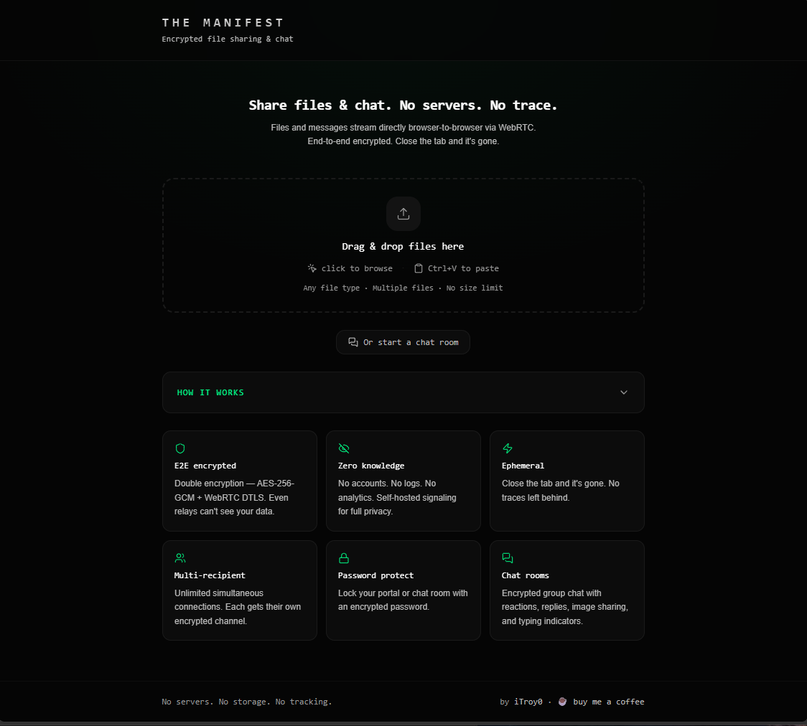

# The Manifest

**[the-manifest-portal.vercel.app](https://the-manifest-portal.vercel.app/)**

Encrypted P2P file sharing and chat. No servers, no accounts, no trace.

## Screenshots

| Home | Sender | Receiver |
|------|--------|----------|
|  |  |  |

## Features

- **End-to-end encrypted** — ECDH key exchange + AES-256-GCM on every chunk, on top of WebRTC DTLS
- **No file size limit** — StreamSaver writes directly to disk, zero RAM bottleneck
- **Per-file or bulk zip download** — recipient chooses what to download
- **Pause, resume, cancel** — full transfer control per file, re-download after cancel
- **Live file sharing** — add files while recipients are already connected
- **File previews** — image thumbnails shown on receiver before downloading
- **Multiple recipients** — unlimited simultaneous connections, each with their own encrypted channel
- **Password-protected portals** — optional password gate with encrypted transmission
- **Encrypted chat rooms** — standalone group chat with typing indicators, emoji reactions, replies, and image sharing
- **Auto-generated nicknames** — editable by all participants, with join/leave notifications
- **Connection quality** — live RTT latency, P2P/Relay badge, key fingerprint verification
- **Resume on disconnect** — auto-reconnects and resumes from the last chunk
- **Self-hosted signaling & relay** — optional PeerJS + coturn for true zero-knowledge
- **Mobile-friendly** — native share API, QR codes, responsive chat with touch support
- **URL linkification** — clickable links in chat (https only, safe against javascript: URLs)
- **Accessible** — ARIA labels, keyboard navigation, screen reader support, WCAG AA contrast
- **Ephemeral** — close the tab and everything is gone

## Getting Started

```bash
npm install
npm run dev
npm test        # run test suite
```

## Environment Variables

```bash
cp .env.example .env
```

| Variable | Description |
|----------|-------------|
| `VITE_TURN_URL` | TURN relay hostname |
| `VITE_TURN_USER` | TURN username |
| `VITE_TURN_PASS` | TURN password |
| `VITE_SIGNAL_HOST` | PeerJS signaling hostname |
| `VITE_SIGNAL_PATH` | PeerJS signaling path (default: `/`) |

## Self-Hosted Servers (Optional)

```bash
sudo bash turn-setup.sh     # TURN relay for strict NATs
sudo bash signal-setup.sh   # PeerJS signaling for zero-knowledge
```

## Tech Stack

React 19, Vite, PeerJS, Web Crypto API, StreamSaver.js, fflate, dnd-kit, Tailwind CSS v4

No backend. No database. Deploy as a static site.

## License

AGPL-3.0 — See [LICENSE](LICENSE) for details.

---

by [iTroy0](https://github.com/iTroy0) — open source, free forever

[☕ Buy me a coffee](https://buymeacoffee.com/itroy0) if you find this useful.
